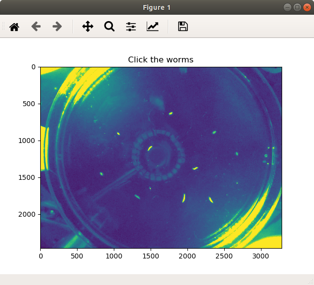
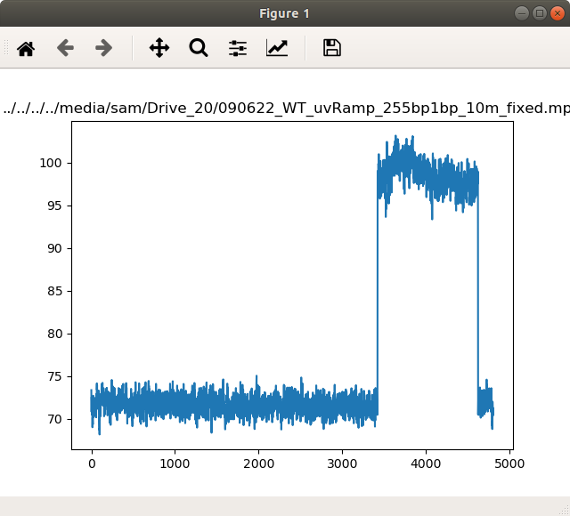
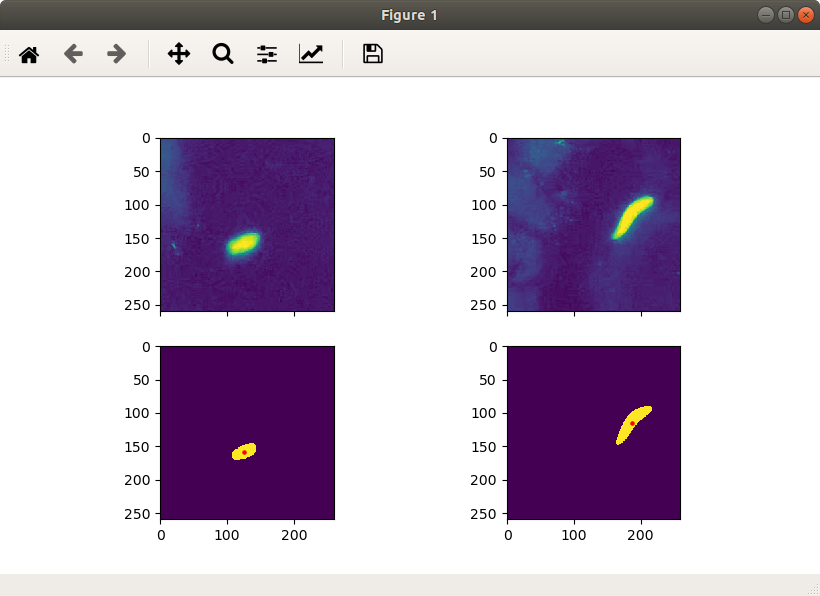

# Planameterization
### (Planarian Parameterization)
================================

Scripts for the segmentation and parametrization of worm behavior. Released in conjuction with the publication "Adaptive robustness through incoherent signaling mechanisms in a regenerating brain". To get started, simply download or pull the repository to your machine and follow the guides below. See **requirements** section in this document for necessary python packages.

### Segmentation

Segmentation is designed to run through the command line terminal with minimal user input. To begin, open a terminal, activate your python environment, and navigate to this repository location. Begin the segmentation with:

```console
conda activate yourEnv
cd path/to/repository
python3 -m segmenting ../path/to/video.mp4
```

Additional passed variables are available. Please see _segmenting.py_ for details. Once running, the script will produce a pop-up window of the following:



Left-click on each of the worms you wish to track to initialize the positions. Right-click to undo selection. Center click when finished to close window and advance. You will then be presented a second window:


Left-click on the stimulus indicator light to allow tracking of its intensity. Script will automatically advance and begin sampling the intensity of this region. When finished, a time trace of the intensity will display:



In the console, enter a threshold value for denoting times when the stimulus is on. Finally, you will be asked to confirm the binarization parameters for worm tracking. You will see the following display with the original image (top) and binarized result (bottom):



There are two alterable settings to account for your imaging setup. *worm size threshold* denotes the minimum binarized feature size that will be considered a worm for tracking. Sizes under current settings are printed in console. *binary threshold scale* adjusts the binarization threshold. Higher values are more strict. To advance without changing, press Enter within the console. The prompts will repeat until you go through a cycle without changing either parameter.

Segmentation will now begin. Files are saved to a subfolder in the pickles/ directory labeled with the video name.

### Eigen-shape reduction with PCA

Once radial measurements have been segmented, worm data can be loaded into a python script. The standard loading process reducess these high dimensional measurement into "eigen-shapes" using PCA. A reference PCA projection definition is provided in the REFERENCE folder.  to changes this, simply delete the existing reference files and put your segmented data in this folder. The load script will detect this and make a new PCA projection based on these data.

For example of data loading, see [*analyzeData.ipynb*](/analyzeData.ipynb)

### Activity tranformation

In the published paper, we convert the timeseries of principal component measurements into a single activity score based on the rate of change of these eigen-shapes over time. For example of this functionality, see [*analyzeData.ipynb*](/analyzeData.ipynb). Note that this functionality requires installation of the [SSM library](https://github.com/slinderman/ssm).  

## Requirements
python3

**segmenting**
skimage,
skvideo,
numpy,
matplotlib,
scipy,
tqdm,

**loading+PCA**
sklearn

**Activity**
pywt
ssm


## Citation


## Authors

* **Samuel Bray**
* **Livia Wyss**
* **Bo Wang**

## License

This project is licensed under GNUV3
